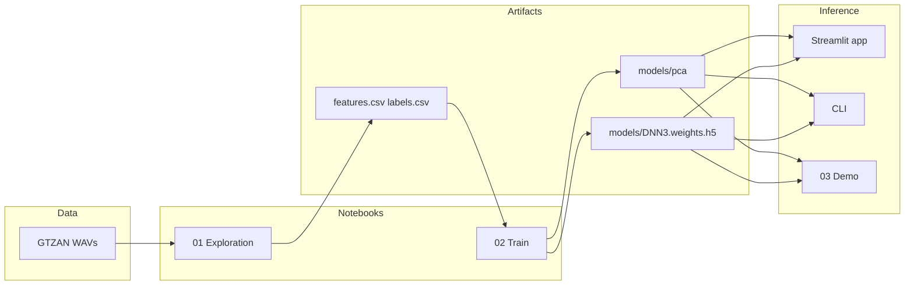
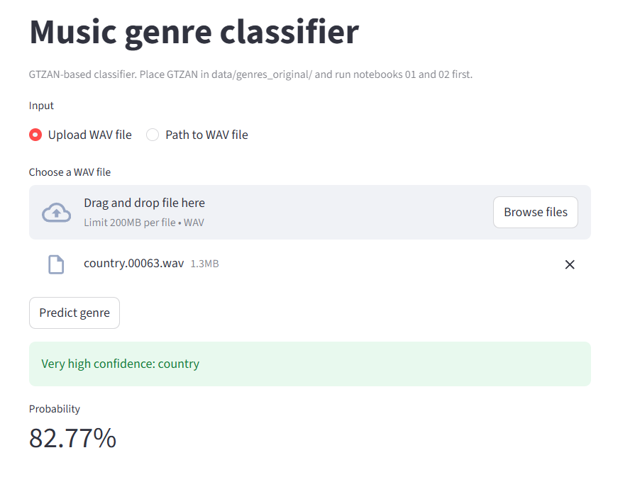

# Machine Learning: Music Genre Detection

A Python project that classifies audio tracks by musical genre using the GTZAN dataset, a DNN classifier, and a simple web interface for inference.

---

## Inspiration

The amount of music streamed daily continues to grow on platforms such as SoundCloud and Spotify. Automatically tagging songs by genre is essential for playlists, recommendations, and library organization. This project explores **automatic music genre classification** from raw audio: from dataset exploration and feature engineering to training a neural network and exposing it via a **Streamlit app** and a **CLI**.

---

## Objectives

### Academic

- Design an end-to-end pipeline for **audio classification** (data loading, feature extraction, dimensionality reduction, model training, and evaluation).
- Work with a standard benchmark dataset (**GTZAN**) and report on data balance, feature distributions, and model performance.
- Apply **deep learning** (fully connected network) on hand-crafted audio features (e.g. MFCCs, spectral and chroma features) after PCA.

### Exploratory

- Understand the structure and limitations of GTZAN (10 genres, 100 tracks per genre).
- Experiment with **feature design** (librosa-based) and **PCA** for dimensionality reduction before the classifier.
- Provide a **usable interface** (Streamlit app and CLI) so that trained models can be tried on new WAV files without opening notebooks.

---

## Architecture

The project is organized as a linear pipeline: **data → features → PCA → DNN → inference**.



### Project structure

| Path | Role |
|------|------|
| `music_genre_classifier/` | Core package: config, data loader (GTZAN), feature extraction, model definition, inference, and CLI. |
| `notebooks/` | **01** – Load GTZAN, extract features, save `features.csv` and `labels.csv`, explore data. **02** – Train PCA + DNN, save `models/pca` and `models/DNN3.weights.h5`. **03** – Inference demo using the package. |
| `app.py` | Streamlit app: upload or path to a WAV, run inference, show genre and confidence. |
| `data/` | (Gitignored) GTZAN dataset: `data/genres_original/<genre>/*.wav`. |
| `models/` | (Gitignored) Trained PCA and DNN weights produced by notebook 02. |

---

## Guide

### 1. Installation

Use a virtual environment (Python 3.9–3.12 recommended):

```bash
python -m venv .venv
.venv\Scripts\activate   # Windows
# source .venv/bin/activate   # Linux/macOS

pip install -r requirements.txt
```

### 2. Data

- Download the [GTZAN dataset](https://www.kaggle.com/datasets/andradaolteanu/gtzan-dataset-music-genre-classification) and place it so that audio files live under:

  ```
  data/
    genres_original/
      blues/    classical/   country/   disco/   hiphop/
      jazz/     metal/       pop/       reggae/  rock/
  ```

- The `data/` and `models/` directories are gitignored.

### 3. Training (notebooks)

Run the notebooks in order from the project root:

1. **01_data_exploration.ipynb** – Loads GTZAN, computes features, saves `features.csv` and `labels.csv`, and explores the dataset.
2. **02_train_model.ipynb** – Loads the CSVs, fits PCA and a DNN, and saves `models/DNN3.weights.h5` and `models/pca`.

### 4. Inference

After training, you can run inference in three ways:

- **Streamlit app** (recommended): from project root, run  
  `streamlit run app.py`  
  Then upload a WAV file or enter a path and click **Predict genre**.
- **Notebook**: open and run **03_inference_demo.ipynb** (paths in the notebook point to `data/genres_original/...`).
- **CLI**:  
  `python -m music_genre_classifier.cli path/to/audio.wav --models-dir models`

---

## Presentation of results

The Streamlit app lets you upload a WAV file or provide a path, then displays the predicted genre with a confidence label and the model’s probability.

### Screenshot



*Streamlit interface: upload a WAV (e.g. country.00063.wav), click Predict genre, then see the predicted genre and probability (e.g. Very high confidence: country, 82.77%).*

Example output: **Very high confidence: country** with **82.77%** probability. The confidence labels (e.g. *Low confidence*, *Confident*, *Very high confidence*) come from the model’s maximum softmax probability and are shown in English in both the app and the CLI.

---

## Security and dependencies

Dependencies are listed in `requirements.txt`. Patched versions are used for:

- `tornado`, `cryptography`, `nbconvert`, `protobuf`, `urllib3`

to address known security advisories. Use Python 3.9–3.12 for compatibility with TensorFlow and the Jupyter stack.

---

## References

- **Rapport.pdf** – Original academic report (historical reference).
- **GTZAN** – [GTZAN Genre Collection](https://www.kaggle.com/datasets/andradaolteanu/gtzan-dataset-music-genre-classification) on Kaggle.
